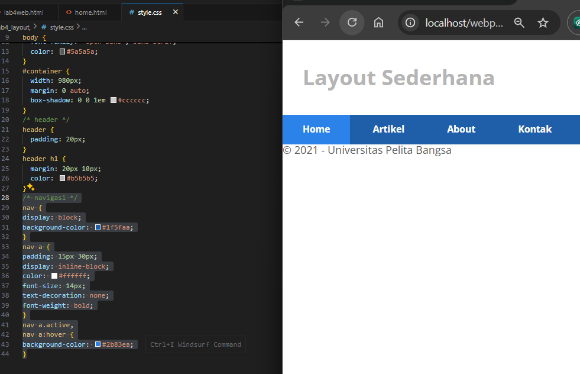

# Membuat CSS Layout

### 1. Persiapan Membuat Dokumen HTML

Buat file HTML dengan nama `lab4_box.html`

**Screenshot:**

---

### 2. Membuat Box Element

Tambahkan kode untuk membuat box element dengan tag div

**Screenshot:**

---

### 3. CSS Float Property

Tambahkan deklarasi CSS pada head untuk membuat float element

**Screenshot:**

---

### 4. Mengatur Clearfix Element

Tambahkan element div lainnya setelah div3 dan atur property clear pada CSS

**Screenshot:**

---

### 5. Membuat Layout Sederhana

Buat folder baru dengan nama `lab4_layout`, kemudian buat file `home.html` dan `style.css`.

**Screenshot:**

---

### 6. Membuat Navigasi

Tambahkan CSS untuk navigasi

**Screenshot:**

---

### 7. Membuat Hero Panel

Tambahkan kode HTML dan CSS untuk hero panel

**Screenshot:**

---

### 8. Membuat Sidebar Widget

Tambahkan element dalam sidebar

**Screenshot:**

---

### 9. Mengatur Footer

Tambahkan CSS untuk footer

**Screenshot:**

---

### 10. Menambahkan Elemen pada Main Content

Tambahkan box dengan gambar pada main content

**Screenshot:**

---

### 11s. Menambahkan Content Artikel

Tambahkan artikel pada main content

**Screenshot:**

---

## Referensi
- Modul Praktikum Pemrograman Web - Universitas Pelita Bangsa
=======
